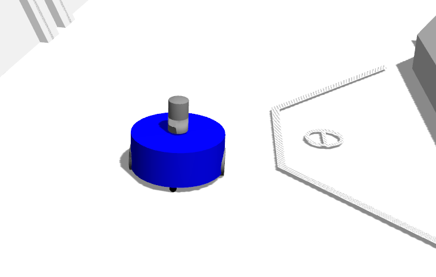
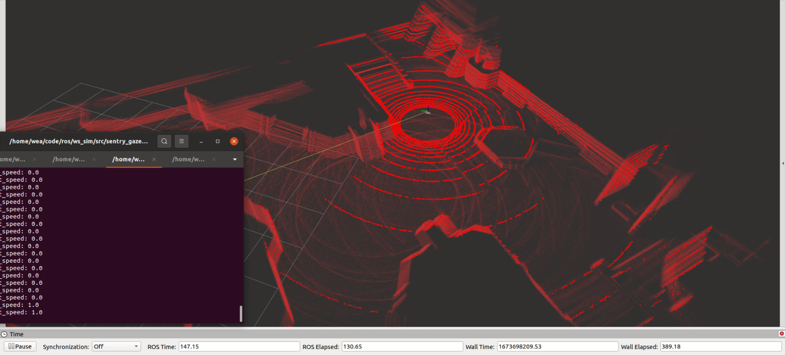
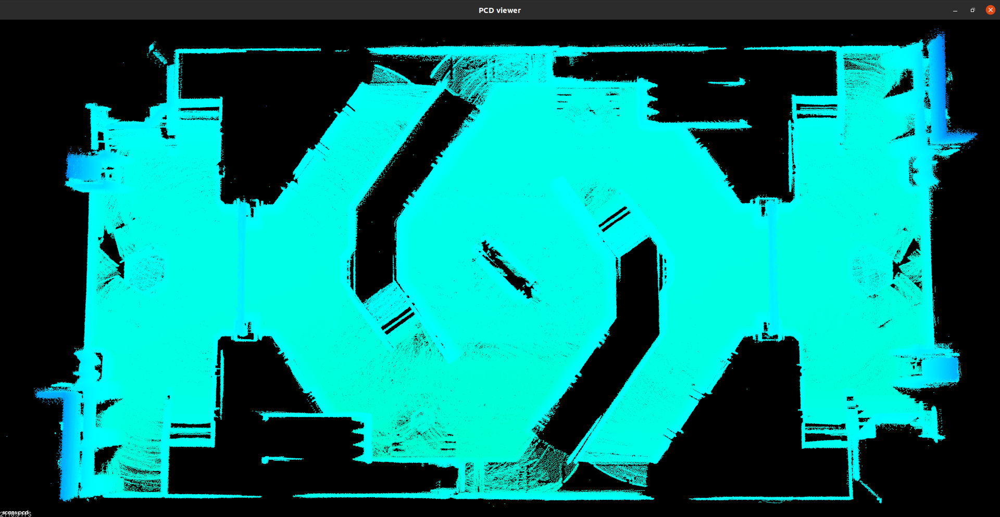

## 仓库介绍
2023哨兵gazebo仿真仓库，包含相关功能包

创建时间：2022/12/26
### 仓库结构
(待完成，每个功能包的功能)
- mbot：两轮小车
- RMUC2022_changdi_1221：场地模型
- sentry233333：简化哨兵四轮模型
- velodyne_simulator：velodyne雷达仿真模型
- sentry：哨兵一带车及其控制器
    - sentry_control：控制器
    - sentry_gazebo：在gazebo中打开哨兵模型和world
    - sentrymodel_1225：哨兵一代车模型
### 环境
执行``sh requirements.sh``
<details>
  <summary>requirements.sh内容</summary>
  
    ```bash
    sudo apt-get install ros-noetic-joint-state-publisher-gui
    sudo apt-get install ros-noetic-robot-state-publisher
    sudo apt-get install ros-noetic-xacro
    sudo apt-get install ros-noetic-pcl-ros
    sudo apt-get install ros-noetic-image-transport
    sudo apt-get install ros-noetic-camera-info-manager
    sudo apt-get install ros-noetic-gazebo-ros ros-noetic-gazebo-ros-control
    sudo apt-get install ros-noetic-gazebo-ros-pkgs
    sudo apt-get install ros-noetic-ros-control
    sudo apt-get install ros-noetic-ros-controllers
    ```
    
</details>

#### sophus
到主目录下
```bash
git clone https://github.com/strasdat/Sophus.git
cd Sophus/
mkdir build
cd build
cmake ..
make
sudo make install
```
#### fmt
```bash
cd fmt
mkdir build
cd build
cmake ..
make
sudo make install
```
#### spdlog

```bash
sudo apt-get install spdlog
```
或者源码编译

```bash
git clone https://github.com/gabime/spdlog.git
cd spdlog
mkdir build
cmake ..
make -j123
```

源码编译碰到了下面的问题：
```
/usr/bin/ld: /usr/local/lib/libspdlog.a(spdlog.cpp.o): relocation R_X86_64_TPOFF32 against `_ZGVZN6spdlog7details2os9thread_idEvE3tid' can not be used when making a shared object; recompile with -fPIC 
```
这个问题看起来是在编译一个共享库时，链接了一个静态库libspdlog.a，但是这个静态库没有使用-fPIC选项编译，导致重定位错误1。你可以尝试重新编译libspdlog.a，加上-fPIC选项，或者使用动态库libspdlog.so2。
这里在spdlog的cmake中添加
```cmake
set(CMAKE_POSITION_INDEPENDENT_CODE ON)
```
即可解决这个问题

## 使用方式
远程仓库用一个文件夹单独管理哨兵gazebo仿真相关的包，使用时直接git clone之后就能catkin_make到，在已有工作空间中使用：
```bash
cd ws_livox/src
# 推荐用ssh,可以不输密码，但是要配置秘钥，http用这个：
# git clone https://gitee.com/sunjingwenrobot/sentry_gazebo_2023.git
git clone git@gitee.com:sunjingwenrobot/sentry_gazebo_2023.git
cd ..
# 单核编译解决编译顺序带来的依赖问题
catkin_make -j1
```
注意如果之前src中有重复的包需要删掉，直接使用仓库里的代码就行，同时git链接的文件夹为sentry_gazebo_2023，要pull或者push要到里面去搞。
同步到新的工作空间

    mkdir -p ws_gazebo_sentry/src
    cd ws_gazebo_sentry/src
    # 推荐用ssh,可以不输密码，但是要配置秘钥，http用这个：
    # git clone https://gitee.com/sunjingwenrobot/sentry_gazebo_2023.git
    git clone git@gitee.com:sunjingwenrobot/sentry_gazebo_2023.git
    catkin_init_workspace
    cd ../
    catkin_make -j1
    source devel/setup.bash
    # 可以启动了
    roslaunch RMUC2022_changdi_0322 gazebo.launch
    

### 启动两轮小车（通常用这个）
具体参照mbot中的readme
##### 启动gazebo仿真环境（在RMUC.world中）
```bash
roslaunch mbot_gazebo mbot_3d_lidar_gazebo.launch
```


##### 加载控制器
```bash
roslaunch mbot_control mbot_control.launch
```
##### 启动按键控制脚本
```bash
roslaunch mbot_teleop mbot_teleop.launch
```
##### 启动建图（Lidar和imu数据由仿真环境发布）
```bash
roslaunch fast_lio mapping_velodyne.launch
```
##### 启动planning的流程（本仓库部分，planning部分到sentry_planning去开）
启动planning相关部分不需要启动FAST-LIO建图，以免拖慢运行速度
```bash
roslaunch mbot_gazebo mbot_3d_lidar_gazebo.launch
roslaunch mbot_control mbot_control.launch
roslaunch mbot_teleop mbot_teleop.launch
```






---
##### 下面的部分大多已经弃用
---

### 启动小哨兵和场地
启动RMUC和小哨兵（带雷达）
```bash
source devel/setup.sh
roslaunch sentry233333 world_lidar.launch
```
启动控制器
```bash
roslaunch sentry233333 controller.launch
```
### 简单启动RMUC
由于RMUC2022模型已经被保存到world2.sdf中，所以可以直接用gazebo命令启动
```bash
cd RMUC2022_changdi_1221
gazebo world/world2.sdf
```
或者从launch文件启动
```bash
roslaunch RMUC2022_changdi_1221 gazebo.launch
```
### 启动大哨兵
在RMUC场地启动大哨兵
```bash
roslaunch sentry_gazebo sentry_rmuc.launch
```
在playground启动大哨兵
```bash
roslaunch sentry_gazebo sentry_3d_lidar_gazebo.launch
```
加载控制器
```bash
roslaunch sentry_control sentry_control.launch
```
按键控制脚本
```bash
roslaunch sentry_teleop sentry_teleop.launch
```
