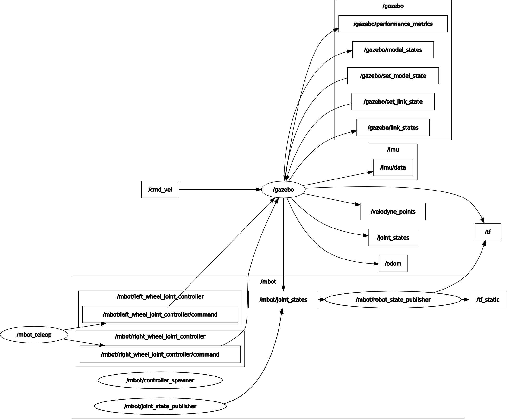
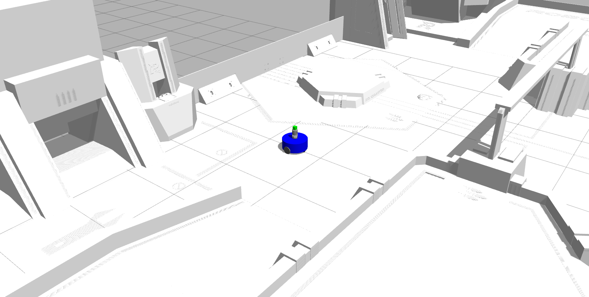

## 两轮小车
---
### 正常启动
#### 启动gazebo仿真环境（在RMUC.world中，一般直接用这个不需要下面第三种）
在mbot_rmuc_lidar_gazebo.launch中选择启动VLP16还是HDL32的world文件来选择雷达
```bash
roslaunch mbot_gazebo mbot_rmuc_lidar_gazebo.launch
```
#### 加载控制器
```bash
roslaunch mbot_control mbot_control.launch
```
- 前进 ： `W`
- 后退 ： `S`
- 左转弯 ： `A`
- 右转弯： `D`
- 左前：`Q`
- 右前：`E`
- 左后：`Z`
- 右后：`C`
    <details>
  <summary>其他控制</summary>

    ```bash
    y/u : 10%加速/减速
    空格, k : 强制停止
    anything else : stop smoothly
    CTRL-C to quit
    ```
    </details>
#### 启动按键控制脚本
```bash
roslaunch mbot_teleop mbot_teleop.launch
```
---
### 一键启动（**推荐别用**，可能会导致gazebo没法再次正常打开需要重启）
```bash
roslaunch mbot_gazebo mbot.launch
```
---
### 启动gazebo仿真环境，用于调整机器人生成位置并创建世界文件
```bash
roslaunch mbot_gazebo mbot_3d_lidar_gazebo.launch
```

### 更新
1. 添加了RMUC场地并且存为world文件，相对路径，初始化robot位置
2. 删除了没用的一些urdf和launch文件，删除2D雷达，加入3D激光雷达和IMU
3. 修改后的部分文件不兼容，防止重名出bug，改动的launch和xacro文件已重命名
4. 更换了键位为wasd
5. 添加一键启动的launch
6. 添加HDL32雷达
7. 场地模型设置为static，同时调整max_step_size调节仿真速度，参考https://www.notion.so/c7e9a94688d945f6a0655f78a25bf9e7
8. 创建`rmuc_static.world`场地，删除`ground_plane`，设置场地模型为静态。修改`mbot_3d_lidar_gazebo.launch`机器人生成位置
9. 修改启动文件内容，启动方式不变
10.生成标准坐标地图`rmuc_std_mbot_HDL32.world`，坐标方向确定为：场地地面为z零点、场地长方向最薄挡板内壁为x轴所在面，场地宽方向最薄挡板内壁为y轴所在面。
11.地图转换完毕，下载链接：https://www.notion.so/f69a8ada61fa4c619ef23b4bfea2d886#803a81a071eb497da55bbd7004b7e5d6

### 更多内容
1. 由于不能初始化robot位置，RMUC场地会由于碰撞直接起飞，现在的做法是保存成world文件，此时就不用再启动机器人模型节点（包含在world文件中），但仍要加载xacro机器人参数，不然state_publisher会出问题（现在发现在加载模型的时候可以设置机器人初始化的位置，保存world文件已经不再是为了有个初始位置，而是可以配置static和仿真速度）
2. robot的模型有改动时，需要用mbot_3d_lidar_gazebo.launch（单独发起的robot节点）打开模型和world，手动合并后保存成world文件，以保证初始化不碰撞。
3. 用mbot_3d_lidar_gazebo.launch启动模型并且调节模型初始位置，保存为world文件后，需要更改里面的绝对路径为相对路径，一般是模型文件的路径需要改。~~然后设置场地模型为static~~（直接使用`rmuc_static`即可），并按照仿真效果调节max_step_size仿真速度，参考https://www.notion.so/c7e9a94688d945f6a0655f78a25bf9e7
4. 在删除`ground_plane`平面过后，调高max_step_size，不会抖动，怀疑是`ground_plane`和场地地面高度相同，车同时计算两个碰撞影响。（猜测）

### 运行效果
#### 系统结构


#### 运行

